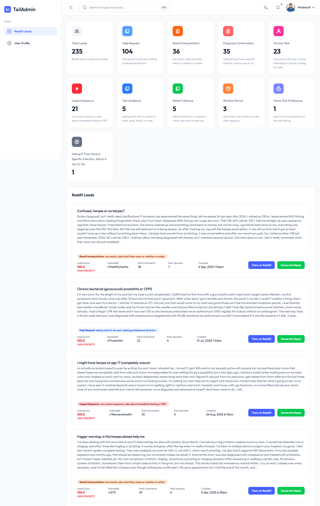
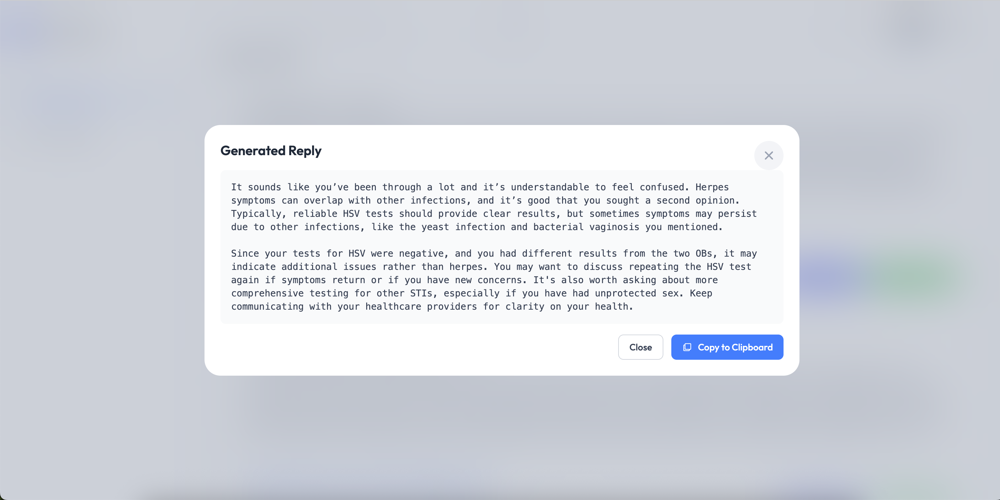

# Screenshot



1. Install dependencies:

   ```bash
   npm install
   # or
   yarn install
   ```

   > Use the `--legacy-peer-deps` flag, if you face issues while installing.

2. Start the development server:
   ```bash
   npm run dev
   # or
   yarn dev
   ```
